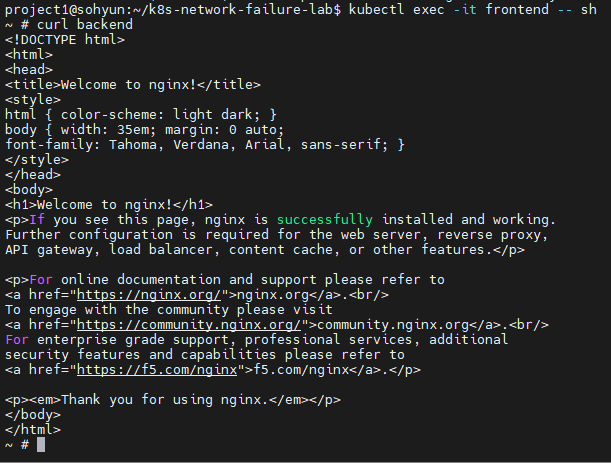
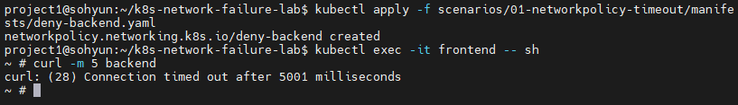
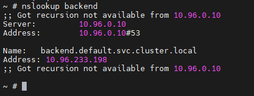
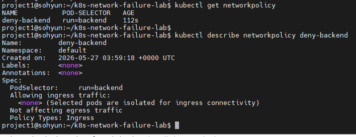
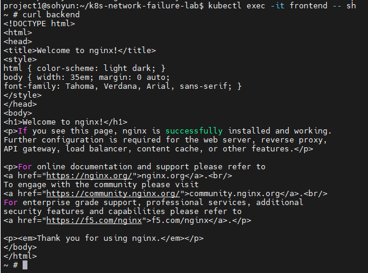

# Scenario 01 - NetworkPolicy Timeout

## Overview

Kubernetes 환경에서 Pod 간 네트워크 통신 장애를 의도적으로 발생시키고,  
트러블슈팅 과정을 통해 원인을 분석하는 시나리오입니다.

frontend pod에서 backend service 호출 시 timeout이 발생하는 상황을 재현하였습니다.

---

## Goal

- Kubernetes Pod 통신 구조 이해
- Service Discovery(DNS)와 실제 네트워크 연결 차이 이해
- NetworkPolicy에 의한 통신 차단 진단
- 네트워크 장애 트러블슈팅 프로세스 학습

---

## Environment

### Cluster

- Kubernetes: kind
- Node 구성
  - control-plane x1
  - worker x1

### Application

- frontend: netshoot
- backend: nginx

---

## Architecture

```text
frontend (netshoot)
        |
        | curl backend
        ↓
backend service (ClusterIP)
        ↓
backend pod (nginx)
```

### Architecture Diagram


---

## Normal State

정상 상태에서는 frontend pod에서 backend service 접근이 가능했습니다.

### Pod 상태 확인

```bash
kubectl get pods
```

결과:

```text
NAME       READY   STATUS
backend    1/1     Running
frontend   1/1     Running
```

### Service 확인

```bash
kubectl get svc
```

결과:

```text
NAME         TYPE        CLUSTER-IP
backend      ClusterIP   10.96.xxx.xxx
kubernetes   ClusterIP   10.96.0.1
```

### DNS 확인

```bash
nslookup backend
```

결과:

```text
backend.default.svc.cluster.local
10.96.xxx.xxx
```

판단:

- DNS 정상
- Service Discovery 정상

### HTTP 통신 확인

```bash
curl backend
```

결과:

```html
Welcome to nginx!
```

정상 상태 확인:



---

## Failure Injection

backend pod ingress traffic을 차단하는 NetworkPolicy를 적용하여 장애를 발생시켰습니다.

### deny-backend.yaml

```yaml
apiVersion: networking.k8s.io/v1
kind: NetworkPolicy
metadata:
  name: deny-backend

spec:
  podSelector:
    matchLabels:
      run: backend

  policyTypes:
  - Ingress
```

### Apply NetworkPolicy

```bash
kubectl apply -f deny-backend.yaml
```

결과:

```text
networkpolicy.networking.k8s.io/deny-backend created
```

---

## Symptoms

frontend pod에서 backend 호출 시 timeout 발생

```bash
curl -m 5 backend
```

결과:

```text
curl: (28) Connection timed out after 5002 milliseconds
```

Timeout 발생:



---

## Troubleshooting Process

### 1. DNS 문제 여부 확인

먼저 DNS 문제 여부를 확인하였습니다.

```bash
nslookup backend
```

결과:

```text
backend.default.svc.cluster.local
10.96.xxx.xxx
```

판단:

- DNS 정상
- Service Discovery 정상
- Name Resolution 문제 아님

DNS 확인:



---

### 2. Backend Pod 상태 확인

backend application 자체 문제인지 확인하기 위해 pod 상태를 점검하였습니다.

```bash
kubectl get pods
```

결과:

```text
backend    1/1 Running
```

판단:

- backend pod 정상 동작
- 애플리케이션 장애 아님

---

### 3. Service 상태 확인

Service misconfiguration 여부를 확인하였습니다.

```bash
kubectl get svc
```

결과:

```text
backend service 정상 존재
```

판단:

- Service 설정 문제 아님

---

### 4. NetworkPolicy 확인

Network 관련 정책 존재 여부를 확인하였습니다.

```bash
kubectl get networkpolicy
```

결과:

```text
NAME             POD-SELECTOR
deny-backend     run=backend
```

상세 확인:

```bash
kubectl describe networkpolicy deny-backend
```

판단:

- backend pod ingress traffic 차단 정책 존재
- frontend → backend 접근 차단 확인

NetworkPolicy 확인:



---

## Root Cause

backend pod에 적용된 NetworkPolicy가 ingress traffic을 차단하여  
frontend → backend 연결이 timeout 발생

즉,

```text
DNS 정상
Pod 정상
Service 정상
↓
NetworkPolicy ingress 차단
↓
Connection timeout 발생
```

---

## Resolution

NetworkPolicy 제거 후 정상 동작 여부 확인

### Delete NetworkPolicy

```bash
kubectl delete networkpolicy deny-backend
```

결과:

```text
networkpolicy.networking.k8s.io "deny-backend" deleted
```

### Recovery Test

```bash
curl backend
```

결과:

```html
Welcome to nginx!
```

복구 확인:



---

## Lessons Learned

- DNS가 정상이어도 실제 TCP 연결은 실패할 수 있다.
- timeout 발생 시 DNS → Pod → Service → Policy 순으로 진단하는 접근이 효과적이었다.
- Kubernetes NetworkPolicy는 Pod 간 통신 제어의 핵심 요소다.
- 네트워크 장애는 단순 증상이 아닌 단계적 검증을 통해 원인을 좁혀가는 과정이 중요하다.

---

## Directory Structure

```text
01-networkpolicy-timeout/
├── README.md
├── manifests
│   └── deny-backend.yaml
└── screenshots
    ├── architecture.png
    ├── 01-normal-curl.png
    ├── 02-timeout-error.png
    ├── 03-dns-ok.png
    ├── 04-network-policy.png
    └── 05-recovered.png
```
