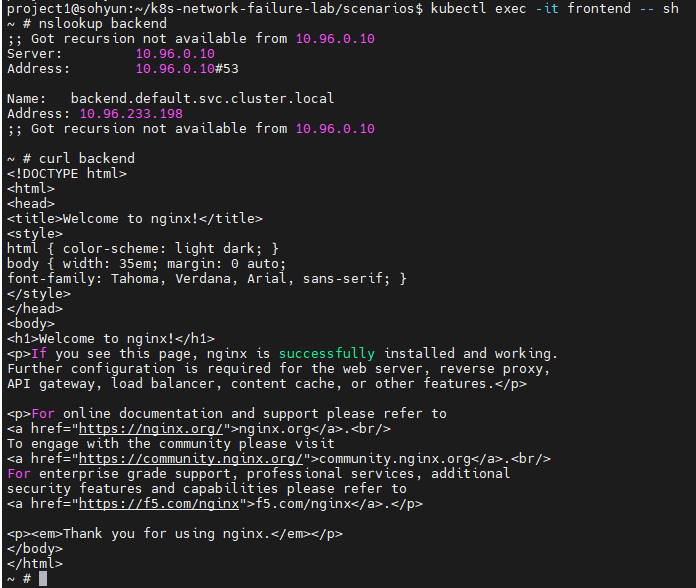
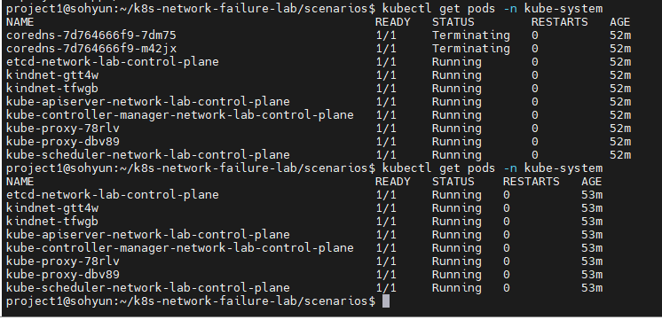
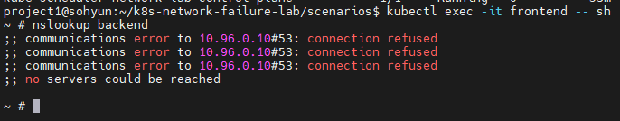
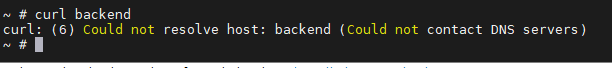
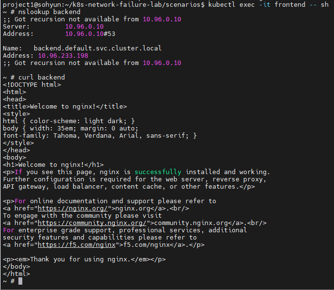

# Scenario 02 - DNS Failure

## Overview

Kubernetes 환경에서 DNS 장애를 의도적으로 발생시키고,  
트러블슈팅 과정을 통해 원인을 분석하는 시나리오입니다.

CoreDNS를 중지하여 Service Discovery가 실패하는 상황을 재현하였습니다.

frontend pod에서 backend service 호출 시 DNS resolution 실패가 발생하는 것을 확인하였습니다.

---

## Goal

- Kubernetes DNS 구조 이해
- CoreDNS 역할 이해
- Service Discovery 방식 이해
- DNS 장애와 네트워크 통신 장애 차이 이해
- DNS 장애 트러블슈팅 프로세스 학습

---

## Environment

### Cluster

- Kubernetes: kind
- Node 구성
  - control-plane x1
  - worker x1

### Application

- frontend: netshoot
- backend: nginx

---

## Architecture

```text
frontend (netshoot)
        |
        | DNS Query
        ↓
CoreDNS
        |
        | Resolve backend service
        ↓
backend.default.svc.cluster.local
        ↓
backend service (ClusterIP)
        ↓
backend pod (nginx)
```

> 전체 클러스터 구성과 정상/장애 시 네트워크 흐름은 [docs/architecture.md](../../docs/architecture.md)에서 확인할 수 있습니다.

---

## Normal State

정상 상태에서는 frontend pod에서 backend service 접근이 가능했습니다.

### DNS 확인

```bash
nslookup backend
```

결과:

```text
backend.default.svc.cluster.local
10.96.xxx.xxx
```

판단:

- DNS 정상
- Service Discovery 정상

### HTTP 통신 확인

```bash
curl backend
```

결과:

```html
Welcome to nginx!
```

정상 상태 확인:



---

## Failure Injection

CoreDNS를 scale down하여 DNS 장애를 발생시켰습니다.

### Current CoreDNS

```bash
kubectl get pods -n kube-system
```

CoreDNS pod 정상 동작 확인

### Scale Down CoreDNS

```bash
kubectl scale deployment coredns \
-n kube-system \
--replicas=0
```

결과:

```text
deployment.apps/coredns scaled
```

CoreDNS 제거 확인:

```bash
kubectl get pods -n kube-system
```

CoreDNS 중지:



---

## Symptoms

frontend pod에서 backend service 접근 실패 발생

frontend pod 접속:

```bash
kubectl exec -it frontend -- sh
```

### DNS 확인

```bash
nslookup backend
```

결과:

```text
communications error to 10.96.0.10#53: connection refused
no servers could be reached
```

판단:

- DNS 서버(CoreDNS) 응답 불가
- Service Discovery 실패

DNS 장애 확인:



---

### HTTP 요청 확인

```bash
curl backend
```

결과:

```text
curl: (6) Could not resolve host: backend
```

판단:

- backend pod 자체 문제가 아님
- DNS resolution 실패로 hostname 변환 불가

curl 실패:



---

## Troubleshooting Process

### 1. Backend Pod 상태 확인

먼저 backend application 자체 문제인지 확인하였습니다.

```bash
kubectl get pods
```

결과:

```text
backend    1/1 Running
frontend   1/1 Running
```

판단:

- Pod 정상
- 애플리케이션 장애 아님

---

### 2. Service 상태 확인

Service misconfiguration 여부를 확인하였습니다.

```bash
kubectl get svc
```

결과:

```text
backend service 정상 존재
```

판단:

- Service 설정 문제 아님

---

### 3. NetworkPolicy 확인

Network 차단 여부 확인

```bash
kubectl get networkpolicy
```

결과:

```text
No resources found
```

판단:

- 네트워크 차단 정책 없음

---

### 4. DNS Resolution 확인

```bash
nslookup backend
```

결과:

```text
connection refused
no servers could be reached
```

판단:

- DNS query 실패
- CoreDNS 이상 가능성 확인

---

### 5. CoreDNS 상태 확인

```bash
kubectl get pods -n kube-system
```

결과:

```text
coredns pod 없음
```

판단:

- CoreDNS scale down 상태
- Kubernetes DNS 기능 중단 확인

---

## Root Cause

CoreDNS가 중지되어 Kubernetes DNS resolution 기능이 동작하지 않았습니다.

그 결과:

```text
frontend
    ↓
backend hostname resolve 실패
    ↓
Could not resolve host
    ↓
HTTP request 실패
```

즉,

```text
Pod 정상
Service 정상
Network 정상
↓
CoreDNS 중지
↓
DNS Resolution 실패
↓
Service 접근 실패
```

---

## Resolution

CoreDNS를 다시 실행하여 정상 복구

### Restore CoreDNS

```bash
kubectl scale deployment coredns \
-n kube-system \
--replicas=2
```

확인:

```bash
kubectl get pods -n kube-system
```

CoreDNS Running 상태 확인

### Recovery Test

frontend pod 접속:

```bash
kubectl exec -it frontend -- sh
```

확인:

```bash
nslookup backend
curl backend
```

결과:

```text
backend.default.svc.cluster.local
10.96.xxx.xxx
```

```html
Welcome to nginx!
```

복구 확인:



---

## Comparison with Scenario 01

| Scenario | Symptom | Root Cause |
|----------|----------|-------------|
| NetworkPolicy Timeout | Connection timed out | NetworkPolicy ingress 차단 |
| DNS Failure | Could not resolve host | CoreDNS 중지 |

핵심 차이:

### Scenario 01

DNS는 정상이나 실제 네트워크 연결이 실패

```text
timeout
```

### Scenario 02

DNS resolution 자체 실패

```text
Could not resolve host
```

---

## Lessons Learned

- DNS 장애와 네트워크 장애는 증상이 다르다.
- timeout과 resolve failure는 원인 분석 방향이 완전히 다르다.
- Kubernetes에서는 CoreDNS가 Service Discovery 핵심 요소다.
- 네트워크 장애 분석 시 DNS → Pod → Service → Policy → CoreDNS 순으로 점검하는 접근이 효과적이었다.

---

## Directory Structure

```text
02-dns-failure/
├── README.md
├── manifests
└── screenshots
    ├── 01-normal-nslookup.png
    ├── 02-coredns-down.png
    ├── 03-dns-failure.png
    ├── 04-curl-resolve-error.png
    └── 05-recovered.png
```
