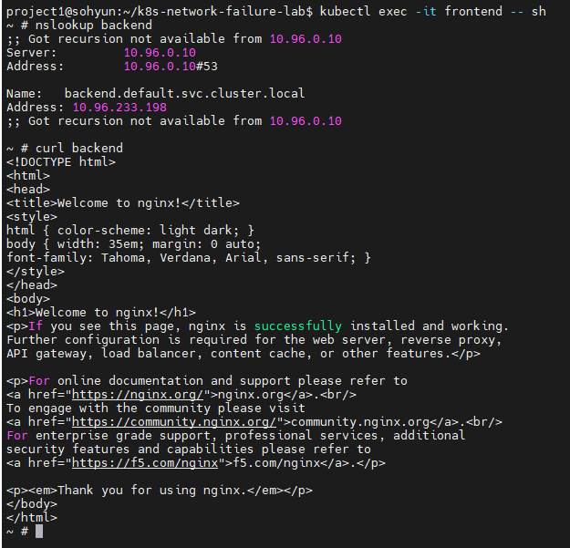
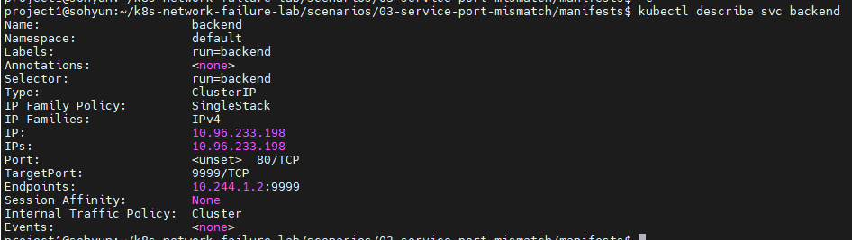
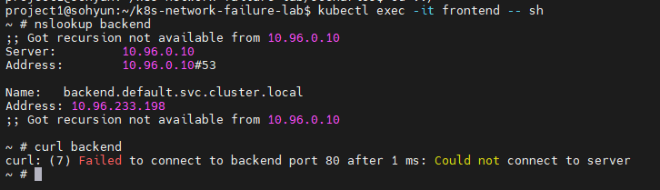
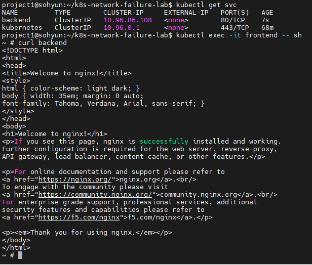

# Scenario 03 - Service Port Mismatch

## Overview

Kubernetes 환경에서 Service의 `targetPort` misconfiguration을 통해
서비스 접근 장애 상황을 재현하고 트러블슈팅 과정을 분석하는 시나리오입니다.

frontend pod에서 backend service 호출 시,
DNS는 정상 동작하지만 Service routing 설정 오류로 인해
애플리케이션 연결 문제가 발생할 수 있는 상황을 실험하였습니다.

---

## Goal

- Kubernetes Service 구조 이해
- `port` 와 `targetPort` 차이 이해
- Service routing 방식 이해
- 설정 오류 기반 네트워크 장애 분석
- Service misconfiguration 트러블슈팅 경험 확보

---

## Environment

### Cluster

- Kubernetes: kind
- Node 구성
  - control-plane x1
  - worker x1

### Application

- frontend: netshoot
- backend: nginx

---

## Architecture

### Normal State

```text
frontend
    ↓
backend service:80
    ↓ targetPort:80
backend nginx pod
```

### Failure State

```text
frontend
    ↓
backend service:80
    ↓ targetPort:9999 ❌
backend nginx pod (listen:80)
```

즉, Service가 실제 backend pod가 listening 하지 않는 포트로
트래픽을 전달하도록 구성하였습니다.

---

## Normal State

정상 상태에서는 frontend pod에서 backend service 접근이 가능했습니다.

frontend pod 접속:

```bash
kubectl exec -it frontend -- sh
```

### DNS 확인

```bash
nslookup backend
```

결과:

```text
backend.default.svc.cluster.local
10.96.xxx.xxx
```

판단:

- DNS 정상
- Service Discovery 정상

### HTTP 요청 확인

```bash
curl backend
```

결과:

```html
Welcome to nginx!
```

정상 상태 확인:



---

## Failure Injection

backend service의 `targetPort` 를 의도적으로 잘못 설정하여
Service routing 문제를 유발하였습니다.

### broken-service.yaml

```yaml
apiVersion: v1
kind: Service
metadata:
  name: backend

spec:
  selector:
    run: backend

  ports:
    - protocol: TCP
      port: 80
      targetPort: 9999
```

핵심 설정:

```yaml
targetPort: 9999
```

실제 nginx는 `80` 포트에서 동작하지만,
Service는 `9999` 포트로 forwarding 하도록 구성하였습니다.

### Apply Service

```bash
kubectl apply -f broken-service.yaml
```

확인:

```bash
kubectl describe svc backend
```

결과:

```text
TargetPort: 9999/TCP
```

Service 설정 확인:



---

## Symptoms

frontend pod에서 backend service 접근 테스트를 진행하였습니다.

frontend 접속:

```bash
kubectl exec -it frontend -- sh
```

### DNS 확인

```bash
nslookup backend
```

결과:

```text
backend.default.svc.cluster.local
```

판단:

- DNS 정상
- CoreDNS 문제 아님

### HTTP 요청 확인

```bash
curl backend
```

테스트 결과를 통해
DNS resolution과 실제 application connectivity는
별개의 문제라는 점을 확인할 수 있었습니다.

테스트 결과:



---

## Troubleshooting Process

### 1. Pod 상태 확인

먼저 backend application 자체 문제인지 확인하였습니다.

```bash
kubectl get pods
```

결과:

```text
backend    Running
frontend   Running
```

판단:

- Pod 정상
- 애플리케이션 장애 아님

---

### 2. DNS 상태 확인

```bash
nslookup backend
```

결과:

```text
backend.default.svc.cluster.local
```

판단:

- DNS 정상
- CoreDNS 문제 아님

---

### 3. Service 설정 확인

Service configuration 문제 여부 확인

```bash
kubectl describe svc backend
```

결과:

```text
TargetPort: 9999/TCP
Endpoints: 10.xxx.xxx.xxx:9999
```

판단:

Service가 backend pod의 실제 listening port(80)가 아닌
`9999` 로 traffic forwarding 하도록 설정되어 있음을 확인하였습니다.

---

### 4. Endpoint 확인

```bash
kubectl get endpoints backend
```

결과:

```text
backend   10.xxx.xxx.xxx:80
```

판단:

실제 pod는 80 포트에서 listening 중이었으며,
Service routing 설정과 차이가 존재하였습니다.

---

## Root Cause

backend pod는 `80 port` 에서 정상 동작 중이었지만,
Service의 `targetPort` 가 `9999` 로 설정되어 있었습니다.

즉,

```text
frontend
    ↓
backend service
    ↓ targetPort:9999 ❌
backend pod (listen:80)
```

Service와 실제 application port 설정이 불일치할 경우
서비스 접근 장애가 발생할 수 있다는 점을 확인하였습니다.

---

## Resolution

정상 Service 재구성

기존 service 삭제:

```bash
kubectl delete svc backend
```

정상 service 재생성:

```bash
kubectl expose pod backend --port=80
```

확인:

```bash
curl backend
```

결과:

```html
Welcome to nginx!
```

복구 확인:



---

## Comparison with Previous Scenarios

| Scenario | Symptom | Root Cause |
|----------|----------|-------------|
| NetworkPolicy Timeout | timeout | ingress traffic 차단 |
| DNS Failure | Could not resolve host | CoreDNS 중지 |
| Service Port Mismatch | service routing issue | targetPort misconfiguration |

---

## Lessons Learned

- Pod가 Running 상태여도 Service 설정 오류로 통신 장애가 발생할 수 있다.
- DNS 정상 여부와 실제 application reachability는 다르다.
- `port` 와 `targetPort` 차이를 정확히 이해해야 한다.
- `kubectl describe svc` 와 `kubectl get endpoints` 는 Service 장애 진단 핵심 명령어였다.
- Kubernetes 장애 진단 시 DNS → Pod → Service → Endpoint 순으로 확인하는 접근이 효과적이었다.

---

## Directory Structure

```text
03-service-port-mismatch/
├── README.md
├── manifests
│   └── broken-service.yaml
└── screenshots
    ├── 01-normal-request.png
    ├── 02-service-misconfigured.png
    ├── 03-service-port-failure.png
    └── 05-recovered.png
```
