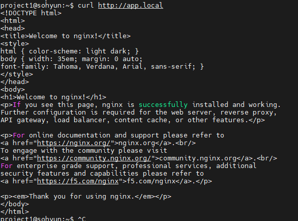
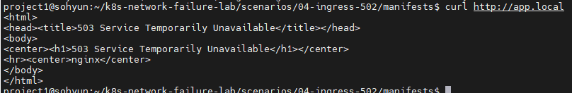
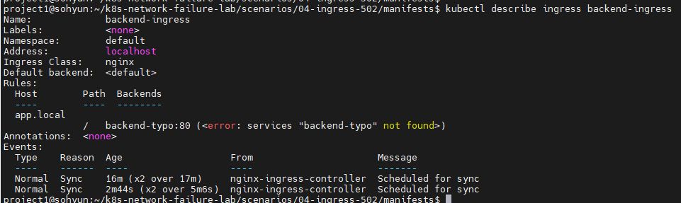
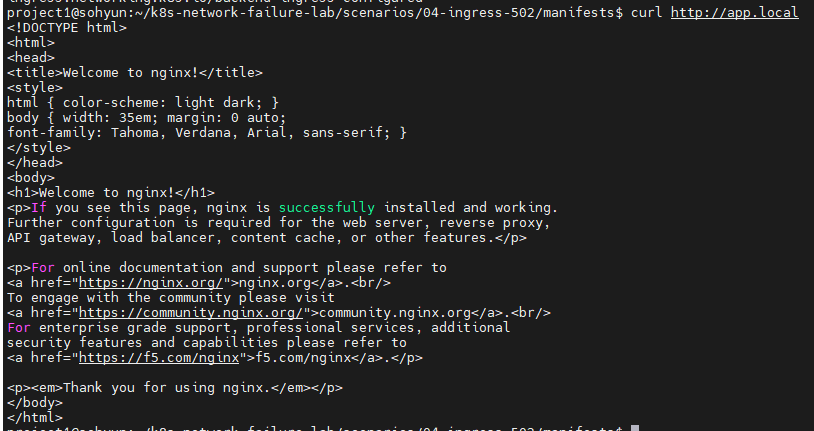

# Scenario 04 - Ingress Upstream Failure (503)

## Overview

Kubernetes 환경에서 Ingress가 존재하지 않는 backend service를 바라보도록 설정하여  
Ingress Layer에서 발생하는 HTTP 503 장애를 재현하고,  
트러블슈팅 과정을 통해 원인을 분석하는 시나리오입니다.

Ingress는 정상적으로 생성되었지만,  
backend service name 오타로 인해 upstream 연결이 실패하는 상황을 의도적으로 만들었습니다.

---

## Goal

- Kubernetes Ingress 동작 구조 이해
- Ingress → Service → Pod 라우팅 흐름 이해
- HTTP 503 장애 원인 분석
- Service 오타 및 잘못된 backend 설정 진단 경험 확보
- 네트워크 트러블슈팅 프로세스 학습

---

## Environment

### Cluster

- Kubernetes: kind
- Node 구성
  - control-plane x1
  - worker x1

### Application

- frontend access: `curl http://app.local`
- backend: nginx
- ingress controller: ingress-nginx

---

## Architecture

### Normal State

```text
Client
   ↓
Ingress (app.local)
   ↓
backend service
   ↓
backend pod (nginx)
```

### Failure State

```text
Client
   ↓
Ingress (app.local)
   ↓
backend-typo service ❌
   ↓
Not Found
```

Ingress가 존재하지 않는 service를 바라보면서
upstream 연결 실패가 발생하도록 구성하였습니다.

---

## Normal State

정상 상태에서는 `app.local` 접근 시 nginx 응답이 정상 반환되었습니다.

### Request

```bash
curl http://app.local
```

### Result

```html
Welcome to nginx!
```



---

## Failure Injection

Ingress backend service 이름을 의도적으로 잘못 설정하여 장애를 유발하였습니다.

### broken-ingress.yaml

```yaml
apiVersion: networking.k8s.io/v1
kind: Ingress
metadata:
  name: backend-ingress

spec:
  ingressClassName: nginx

  rules:
  - host: app.local
    http:
      paths:
      - path: /
        pathType: Prefix
        backend:
          service:
            name: backend-typo
            port:
              number: 80
```

핵심 변경 사항:

```yaml
name: backend-typo
```

존재하지 않는 service를 참조하도록 설정하였습니다.

### Apply

```bash
kubectl apply -f broken-ingress.yaml
```

---

## Symptoms

Ingress 접근 시 HTTP 503 에러 발생

### Request

```bash
curl http://app.local
```

### Result

```html
503 Service Temporarily Unavailable
```



---

## Troubleshooting Process

### 1. Backend Pod 상태 확인

먼저 애플리케이션 자체 문제 여부를 확인하였습니다.

```bash
kubectl get pods
```

결과:

```text
backend   Running
frontend  Running
```

판단:

* Pod 정상
* 애플리케이션 장애 아님

---

### 2. Service 존재 여부 확인

Service가 정상 존재하는지 확인하였습니다.

```bash
kubectl get svc
```

결과:

```text
backend
```

판단:

* backend service 정상 존재
* Service 자체 삭제 이슈 아님

---

### 3. Ingress 설정 확인

Ingress backend 설정 확인

```bash
kubectl describe ingress backend-ingress
```

결과:

```text
backend-typo:80
<error: services "backend-typo" not found>
```

판단:

* Ingress는 정상 생성됨
* 하지만 backend service 이름 오타 존재
* upstream 연결 실패 발생



---

## Root Cause

Ingress가 존재하지 않는 service를 backend로 참조하고 있었습니다.

```text
backend-typo
```

실제 존재하는 service는:

```text
backend
```

따라서 ingress controller가 upstream endpoint를 찾지 못하여

```text
503 Service Temporarily Unavailable
```

응답을 반환하였습니다.

> 환경에 따라 nginx ingress에서는
> `502 Bad Gateway` 또는 `503 Service Temporarily Unavailable` 이 발생할 수 있습니다.

---

## Resolution

정상 ingress 설정 재적용

```bash
kubectl apply -f ingress.yaml
```

복구 확인

```bash
curl http://app.local
```

결과:

```html
Welcome to nginx!
```



---

## Lessons Learned

* Ingress 장애는 DNS 문제가 아니라 upstream routing 문제일 수 있다.
* Pod와 Service가 정상이어도 Ingress backend 설정 오류로 서비스 장애가 발생할 수 있다.
* HTTP 503 발생 시 Pod → Service → Ingress 순으로 확인하는 접근이 효과적이었다.
* Service name typo는 실무에서 자주 발생하는 설정 실수 중 하나다.
