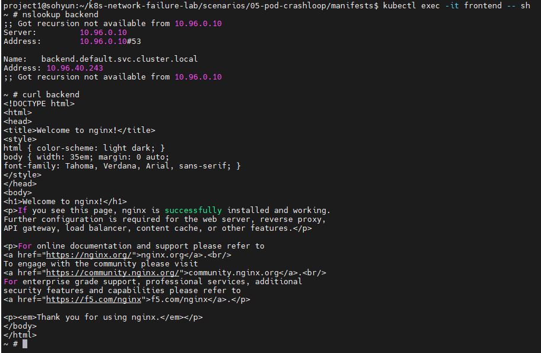
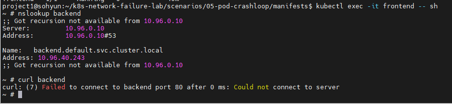
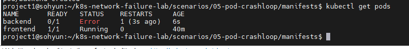
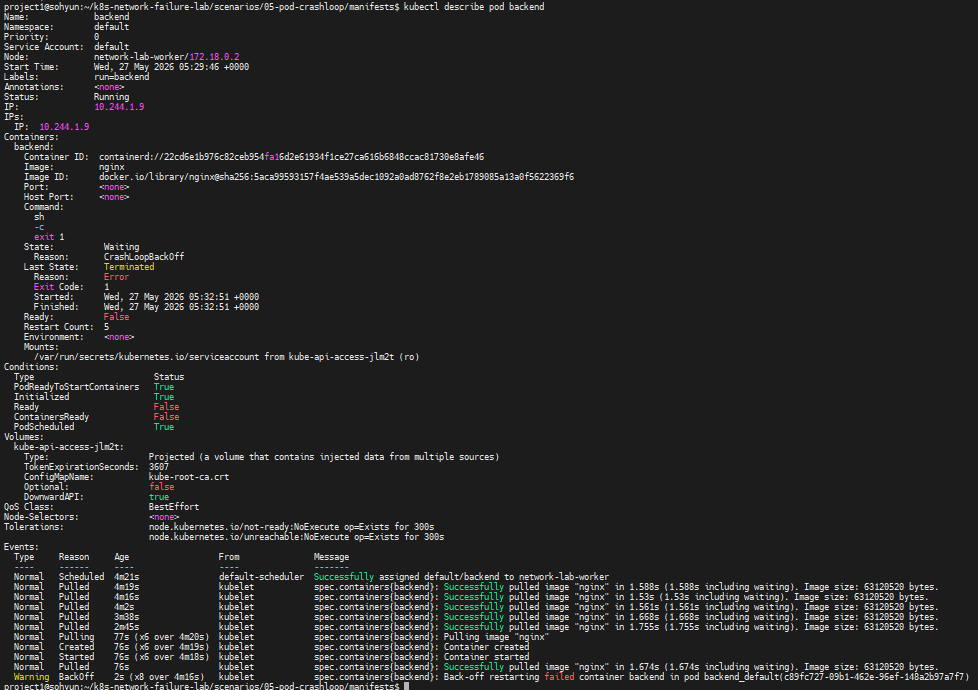
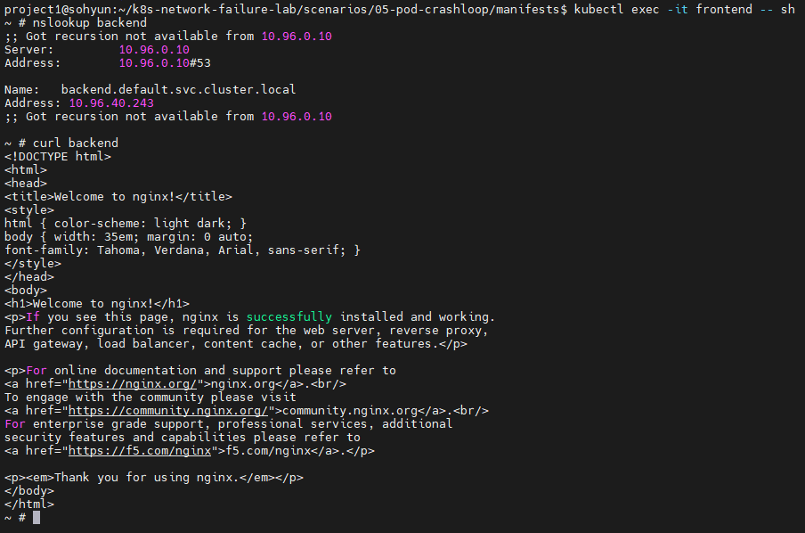

# Scenario 05 - Pod CrashLoop → Connection Failure

## Overview

Kubernetes 환경에서 backend pod가 지속적으로 종료되도록 구성하여
CrashLoopBackOff 상태를 의도적으로 발생시키고,
트러블슈팅 과정을 통해 연결 실패 원인을 분석하는 시나리오입니다.

frontend pod에서 backend service 접근 시 연결 실패가 발생하지만,
실제 원인은 네트워크가 아닌 backend pod 프로세스 비정상 종료 상황을 재현하였습니다.

---

## Goal

- Kubernetes Pod Lifecycle 이해
- CrashLoopBackOff 원인 분석 경험 확보
- DNS / Service / Endpoint / Pod 상태 기반 트러블슈팅 학습
- 네트워크 장애처럼 보이는 애플리케이션 문제 구분 능력 확보

---

## Environment

### Cluster

- Kubernetes: kind
- Node 구성
  - control-plane x1
  - worker x1

### Application

- frontend: netshoot
- backend: nginx (CrashLoop 유발)

---

## Architecture

### Normal State

```text
frontend
    ↓
backend service
    ↓
backend pod (nginx)
```

### Failure State

```text
frontend
    ↓
backend service
    ↓
backend pod ❌
(exit 1 반복)
```

backend pod가 지속적으로 종료되기 때문에
Service가 정상 endpoint를 가지지 못하는 상태를 의도적으로 구성하였습니다.

---

## Normal State

정상 상태에서는 backend service 접근이 가능했습니다.

### DNS 확인

```bash
nslookup backend
```

### HTTP 통신 확인

```bash
curl backend
```

### Result

```html
Welcome to nginx!
```



---

## Failure Injection

backend pod가 시작 직후 종료되도록 command를 의도적으로 변경하였습니다.

### crash-pod.yaml

```yaml
apiVersion: v1
kind: Pod
metadata:
  name: backend
  labels:
    run: backend

spec:
  containers:
  - name: backend
    image: nginx
    command:
      - sh
      - -c
      - "exit 1"
```

핵심 설정:

```yaml
command:
  - sh
  - -c
  - "exit 1"
```

컨테이너 시작 즉시 종료하도록 설정하여
CrashLoopBackOff 상태를 유도하였습니다.

### Apply

```bash
kubectl apply -f crash-pod.yaml
```

---

## Symptoms

frontend pod에서 backend 접근 실패 발생

### Request

```bash
curl -m 5 backend
```

### Result

```text
Failed to connect
```

또는 환경에 따라:

```text
Connection refused
```

DNS는 정상 동작하지만
실제 backend 연결이 실패하는 상황을 확인할 수 있었습니다.



---

## Troubleshooting Process

### 1. DNS 확인

먼저 DNS 문제 여부를 확인하였습니다.

```bash
kubectl exec -it frontend -- sh
```

```bash
nslookup backend
```

결과:

```text
backend.default.svc.cluster.local
10.96.xxx.xxx
```

판단:

* DNS 정상
* Service Discovery 정상

즉, DNS 문제는 아님

---

### 2. Service 확인

backend service 존재 여부 확인

```bash
kubectl get svc
```

결과:

```text
backend
```

판단:

* Service 정상 존재
* Service 삭제 문제 아님

---

### 3. Endpoint 확인

Service endpoint 상태 확인

```bash
kubectl get endpoints backend
```

결과:

```text
<none>
```

판단:

* Service가 backend pod endpoint를 가지지 못함
* Ready 상태 pod 없음

핵심 포인트:

> Kubernetes Service는 Ready 상태 Pod만 Endpoint로 등록한다.

---

### 4. Pod 상태 확인

backend pod 상태 확인

```bash
kubectl get pods
```

결과:

```text
backend   0/1   CrashLoopBackOff
```

추가 분석:

```bash
kubectl describe pod backend
```

결과:

```text
Exit Code: 1
Back-off restarting failed container
```

판단:

* 애플리케이션 프로세스 비정상 종료
* Kubernetes가 재시작 반복
* CrashLoopBackOff 발생





---

## Root Cause

backend container가 시작 직후 종료되도록 설정되어 있었습니다.

```yaml
command:
  - sh
  - -c
  - "exit 1"
```

이로 인해:

```text
Container 종료
↓
Kubernetes 재시작
↓
재종료 반복
↓
CrashLoopBackOff
```

결과적으로 backend pod가 Ready 상태가 되지 못하여
Service endpoint가 생성되지 않았고,
frontend → backend 연결 실패가 발생하였습니다.

---

## Resolution

비정상 backend pod 삭제

```bash
kubectl delete pod backend
```

정상 backend 재생성

```bash
kubectl run backend \
--image=nginx \
--labels run=backend
```

Service 확인

```bash
kubectl get svc
```

복구 확인

```bash
kubectl exec -it frontend -- sh
```

```bash
curl backend
```

결과:

```html
Welcome to nginx!
```



---

## Lessons Learned

* 연결 실패가 항상 네트워크 문제는 아니다.
* DNS와 Service가 정상이어도 Pod 상태 문제로 장애가 발생할 수 있다.
* Kubernetes Service는 Ready 상태 Pod만 Endpoint로 등록한다.
* 장애 발생 시 DNS → Service → Endpoint → Pod 순으로 확인하는 접근이 효과적이었다.
* CrashLoopBackOff는 애플리케이션 프로세스 문제 가능성이 높다.
